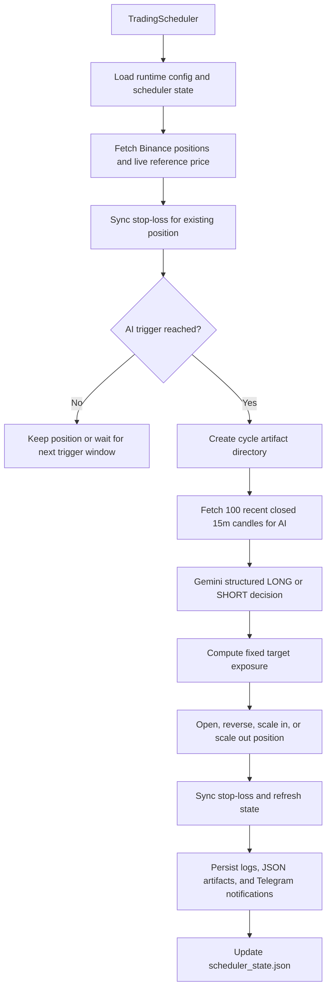

# HAK GEMINI BINANCE TRADER

## "어떻게 LLM을 트레이딩에 활용할 것인지에 대한 크랜선의 대답"
“Crane Sun's answer on how to utilize LLMs in trading”

HAK GEMINI BINANCE TRADER는 고정 포지션 사이징, Gemini 기반 방향성 판단, 가격 기준 재평가 트리거, 거래소 제약을 반영한 주문 실행 등 Investing AI PO "크랜선"의 3년 간의 LLM 기반 코인 트레이딩 노하우를 녹여 제작한 BTC/USDT 선물 트레이딩 자동화 시스템입니다.

HAK GEMINI BINANCE TRADER is an automated BTC/USDT futures trading system developed by incorporating Investing AI PO “Crane Sun”’s three years of LLM-based cryptocurrency trading expertise, including fixed position sizing, Gemini-based trend analysis, price-triggered re-evaluation, and order execution that accounts for exchange constraints.

> Risk Notice: This repository is provided for research and educational purposes only. It is not financial advice. Use at your own risk, and test in a paper or demo environment before deploying with real funds.
>
> 리스크 고지: 이 저장소는 연구 목적의 자료이며 금융 조언이 아닙니다. 사용에 따른 책임은 사용자 본인에게 있으며, 실제 자금을 투입하기 전에 반드시 모의 또는 데모 환경에서 먼저 테스트하세요.

## Research Thesis | 연구 가설과 자동화 우위

이 시스템은 "LLM에게 모든 것을 맡기지 않는다"는 연구 결론 위에 설계되었습니다. 여러 실험 끝에 가장 좋은 결과를 낸 방식은 LLM에게 포지션 크기, 리스크 관리, 주문 실행까지 맡기는 것이 아니라 오직 방향성 판단이라는 하나의 고부가가치 과제만 맡기는 구조였습니다. 그래서 Gemini 프롬프트는 평범한 노이즈 캔들에 흔들리지 않고, 최근 마감된 100개의 15분봉 구조 안에서 정말 중요한 캔들과 시장 구조만 보고 `LONG` 또는 `SHORT`만 반환하도록 설계되었습니다.

This system is built on a clear research conclusion: do not ask an LLM to do everything. After repeated experiments, the best results came from giving the model one high-value cognitive job only, directional judgment. That is why the Gemini prompt is intentionally strong and narrow: it is designed to ignore ordinary candle noise, focus on the dominant structure inside the latest 100 closed 15-minute candles, and return only a `LONG` or `SHORT` decision.

포지션 사이징은 반대로 최대한 기계적이어야 했습니다. 현재 런타임은 `initial_position_size_ratio` 하나만 사용해 목표 증거금 비율을 고정하고, Gemini는 방향만 판단하며, 시스템은 Binance Futures 제약에 맞는 수량 계산, 포지션 리밸런싱, 손절 동기화까지 자동으로 수행합니다.

Position sizing, by contrast, is intentionally mechanical. The current runtime uses `initial_position_size_ratio` as the single fixed margin usage ratio for fresh entries, reversals, and same-direction rebalancing while Gemini remains responsible only for directional judgment.

- Research-backed role split: the model is used for directional conviction, while sizing and execution remain deterministic and auditable.
- 연구 기반 역할 분리: 모델은 방향성 확신 판단에만 쓰이고, 사이징과 실행은 결정론적이고 추적 가능한 로직으로 고정됩니다.

- Fixed exposure discipline: under the current runtime, exposure is deliberately anchored to `initial_position_size_ratio` so that direction and execution remain easier to audit.
- 고정 익스포저 규율: 현재 런타임에서는 익스포저를 `initial_position_size_ratio` 에 고정해 방향 판단과 주문 실행을 더 쉽게 추적할 수 있습니다.

- Research translated into automation: the thesis is enforced live through stateful price triggers, exchange-aware order filters, and synchronized risk protection.
- 연구의 실전 자동화: 이 가설은 상태 기반 가격 트리거, 거래소 제약 반영 주문, 동기화된 리스크 보호 로직으로 실제 운용에 녹아 있습니다.

## Project Snapshot | 프로젝트 한눈에 보기

| Item | Description |
| --- | --- |
| Market Scope | BTCUSDT only, intentionally narrowed for operational clarity and safer execution scope. |
| Decision Engine | Gemini 3.1 Pro Preview returns a structured `LONG` or `SHORT` decision from the latest 100 closed 15-minute candles. |
| Scheduler | A persistent scheduler manages cycle cadence, price-triggered AI re-evaluation, state, and graceful shutdown. |
| Risk Controls | Fixed leverage, exchange-aware quantity adjustment, min-notional checks, and account-risk-based stop-loss synchronization. |
| Position Sizing | The runtime uses the fixed `initial_position_size_ratio` for fresh entries, reversals, and rebalancing. |
| Observability | Logs, JSON artifacts, state persistence, and optional Telegram notifications make each cycle reviewable. |

## Why This Project Stands Out | 이 프로젝트의 강점

- Stateful trigger engine: the system remembers the last AI trigger price, next trigger window, and last AI decision through `scheduler_state.json`, which reduces noisy re-evaluation and makes the loop operationally disciplined.
- 상태 기반 트리거 엔진: `scheduler_state.json`에 마지막 AI 트리거 가격, 다음 트리거 구간, 마지막 AI 방향을 저장하여 불필요한 재판단을 줄이고 실행 흐름을 안정적으로 유지합니다.

- Structured AI integration: the AI is not allowed to produce arbitrary trading prose. It must return a constrained `LONG` or `SHORT` JSON decision, which is significantly easier to validate and connect to execution logic.
- 구조화된 AI 연동: AI가 자유 형식 문장을 반환하는 것이 아니라 `LONG` 또는 `SHORT`만 포함한 구조화된 JSON을 반환하도록 제한되어 있어, 검증과 주문 실행 연결이 훨씬 안정적입니다.

- Exchange-aware execution: position sizing and order submission respect Binance Futures constraints such as lot size, tick size, leverage, min notional, reduce-only close logic, and transient API retry handling.
- 거래소 제약을 반영한 실행: 포지션 크기 계산과 주문 실행은 Binance Futures의 수량 단위, 가격 틱, 레버리지, 최소 주문 금액, reduce-only 청산 로직, 일시적 API 장애 재시도까지 고려합니다.

- Fixed sizing mode: every managed position targets the configured `initial_position_size_ratio`, which keeps exposure behavior deterministic and easier to inspect.
- 고정 사이징 모드: 모든 관리 포지션은 설정된 `initial_position_size_ratio` 를 목표로 하므로 익스포저 동작이 결정론적이고 점검하기 쉬워집니다.

- Auditability by design: every AI-triggered cycle can leave behind structured artifacts such as prompt input, AI output, and final cycle output, making the system explainable to reviewers and maintainers.
- 설계 차원의 추적 가능성: AI가 개입한 각 사이클은 프롬프트 입력, AI 출력, 최종 실행 결과를 JSON으로 남길 수 있어, 리뷰어와 유지보수자가 흐름을 추적하고 설명하기 쉽습니다.

- Operator visibility: the runtime supports detailed logging and optional Telegram notifications for cycle start, AI direction, cycle completion, and unexpected failures.
- 운영자 가시성: 상세 로그와 선택적 Telegram 알림을 통해 사이클 시작, AI 판단, 실행 결과, 예외 상황을 빠르게 확인할 수 있습니다.

## System Architecture | 시스템 아키텍처



## End-to-End Runtime Loop | 핵심 실행 루프

1. The scheduler wakes up on the configured cycle interval and loads persistent state.
   스케줄러가 설정된 주기에 맞춰 깨어나고, 이전 사이클에서 저장된 상태를 불러옵니다.

2. The runtime fetches current Binance Futures positions and a live reference price.
   현재 Binance Futures 포지션과 실시간 기준 가격을 조회합니다.

3. If there is an existing position, the system first verifies and synchronizes stop-loss protection from the stored account-risk basis.
   기존 포지션이 있으면 먼저 저장된 계좌 리스크 기준으로 손절 보호 주문 상태를 점검하고 동기화합니다.

4. The trigger engine decides whether the latest price move is large enough to justify a fresh AI decision, and AI re-evaluation remains price-triggered only.
   트리거 엔진은 최근 가격 변동이 새로운 AI 판단을 요청할 만큼 충분한지 판정하며, AI 재판단은 가격 트리거 기준으로만 동작합니다.

5. If the configured price trigger is not reached, the system updates state and exits the cycle without unnecessary AI cost.
   설정된 가격 트리거에 도달하지 못하면 상태만 갱신하고 AI 비용을 발생시키지 않은 채 사이클을 종료합니다.

6. If the trigger is reached, the runtime creates a cycle directory and gathers the latest 100 closed 15-minute candles for Gemini.
   트리거가 충족되면 사이클 디렉터리를 만들고 Gemini용 최근 마감 100개 15분봉을 수집합니다.

7. Gemini receives structured market context and returns a strict `LONG` or `SHORT` decision.
   Gemini는 구조화된 시장 컨텍스트를 받아 엄격한 `LONG` 또는 `SHORT` 결정을 반환합니다.

8. The system always targets the fixed `initial_position_size_ratio` when sizing new or existing positions.
   시스템은 신규 진입과 기존 포지션 리밸런싱 모두에서 고정 `initial_position_size_ratio` 를 목표 비중으로 사용합니다.

9. Based on the AI direction and the current position state, the system may open, reverse, scale in, or scale out.
   AI 방향과 현재 포지션 상태에 따라 신규 진입, 반전, 증액, 축소가 실행될 수 있습니다.

10. The runtime synchronizes stop-loss from the active account-risk basis, persists cycle artifacts, sends optional notifications, and saves scheduler state.
    실행 후 활성 계좌 리스크 기준으로 손절 상태를 다시 동기화하고, 사이클 산출물을 저장하며, 선택적으로 알림을 보내고, 최종 상태를 보존합니다.

## Repository Structure | 저장소 구조

```text
binance_bol_trader/
├── main.py
├── requirements.txt
├── setting.yaml
├── .env
├── README.md
└── src/
    ├── ai/
    │   ├── __init__.py
    │   └── gemini_trader.py
    ├── binance/
    │   ├── binance_rate_limit.py
    │   ├── common.py
    │   ├── market_data.py
    │   └── trade_position.py
    ├── infra/
    │   ├── env_loader.py
    │   ├── logger.py
    │   └── telegram.py
    └── strategy/
        ├── hakai_strategy.py
        ├── runtime_config.py
        └── scheduler.py
```

## Key Files and Responsibilities | 핵심 파일과 역할

| Path | Role |
| --- | --- |
| `main.py` | CLI entrypoint. Runs one cycle with `--once` or starts the long-running scheduler. |
| `src/strategy/scheduler.py` | Orchestrates scheduling, state persistence, and Telegram notifications for the price-triggered runtime. |
| `src/strategy/hakai_strategy.py` | Core trading logic: trigger evaluation, AI cycle execution, fixed sizing, and result persistence. |
| `src/ai/gemini_trader.py` | Builds Gemini prompts, validates structured responses, estimates token cost, and saves AI artifacts. |
| `src/binance/trade_position.py` | Handles Binance Futures execution, leverage, position inspection, stop-loss sync, and exchange filters. |
| `src/binance/market_data.py` | Fetches and normalizes OHLCV data for the closed 15-minute AI prompt. |
| `src/binance/binance_rate_limit.py` | Retry logic for transient Binance API failures, rate limits, and execution-unknown cases. |
| `src/infra/env_loader.py` | Loads secrets and runtime environment variables from the environment or `.env`. |
| `src/infra/logger.py` | Centralized root logger configuration and structured log formatting. |
| `src/infra/telegram.py` | Telegram HTML-safe formatting, chunking, and delivery for operator notifications. |
| `setting.yaml` | Strategy configuration for trigger threshold, cadence, leverage, stop-loss, and sizing parameters. |

## Environment Setup | 실행 환경 준비

Use Python 3.13 or newer for this project. 이 프로젝트는 Python 3.13 이상에서 실행하세요.

### 1. Create and activate a virtual environment | 가상환경 생성 및 활성화

```bash
python3 -m venv venv
source venv/bin/activate
```

If you are on Windows PowerShell:

```powershell
python -m venv venv
venv\Scripts\Activate.ps1
```

### 2. Install dependencies | 의존성 설치

```bash
pip install --upgrade pip
pip install -r requirements.txt
```

### 3. Prepare your `.env` file | `.env` 파일 준비

Create a local `.env` file in the repository root.

저장소 루트에 로컬 `.env` 파일을 준비하세요.

```dotenv
GEMINI_API_KEY=your_gemini_api_key
BINANCE_API_KEY=your_binance_api_key
BINANCE_API_SECRET=your_binance_api_secret

# Optional Telegram notifications
TELEGRAM_BOT_TOKEN=your_telegram_bot_token
TELEGRAM_CHAT_ID=your_telegram_chat_id
```

### Environment Variables | 환경변수 설명

| Variable | Required | Description |
| --- | --- | --- |
| `GEMINI_API_KEY` | Yes | Gemini API key used for directional decision generation. |
| `BINANCE_API_KEY` | Yes | Binance Futures API key. |
| `BINANCE_API_SECRET` | Yes | Binance Futures API secret. |
| `TELEGRAM_BOT_TOKEN` | Optional | Telegram bot token for runtime notifications. |
| `TELEGRAM_CHAT_ID` | Optional | Telegram target chat ID for notifications. |

## `setting.yaml` Guide | `setting.yaml` 설명

The strategy runtime reads `setting.yaml` on every cycle, so these values define the live operational behavior of the system.

전략 런타임은 매 사이클마다 `setting.yaml`을 읽기 때문에, 이 파일의 값들이 실제 운영 동작을 직접 결정합니다.

| Key | Meaning | Current / Typical Value |
| --- | --- | --- |
| `symbol` | Trading symbol. The current runtime intentionally supports only `BTCUSDT`. | `BTCUSDT` |
| `cycle_interval_seconds` | Main scheduler cycle interval. | `60` |
| `trigger_pct_usdt` | Percent move from the last AI trigger price required to request a new AI decision. | `0.75` |
| `ai_prompt_timeframe` | Timeframe sent to the AI model. The current runtime supports only `15m`. | `15m` |
| `ai_prompt_candle_count` | Number of recent closed 15-minute candles sent to the AI model. | `100` |
| `gemini_thinking_level` | Gemini 3.1 Pro Preview reasoning level. Supported values: `low`, `medium`, `high`. | `high` |
| `fixed_leverage` | Fixed leverage applied on entry and position sizing logic. | `10` |
| `stop_loss_pct` | Account-level stop-loss risk ratio, converted into an entry-price stop distance from effective leverage. | `0.04` |
| `initial_position_size_ratio` | Fixed margin usage ratio used for fresh entries, reversals, and rebalancing. | `0.4` |
| `gemini_api_version` | Optional runtime config key with a default in code. | `v1beta` by default |

### How `setting.yaml` affects behavior | `setting.yaml`이 실제 동작에 미치는 영향

- A lower `trigger_pct_usdt` means more frequent AI re-evaluation.
- `trigger_pct_usdt`가 낮을수록 AI 재판단 빈도가 높아집니다.

- A higher `cycle_interval_seconds` reduces operational frequency and API activity.
- `cycle_interval_seconds`가 높을수록 운영 빈도와 API 호출 빈도가 줄어듭니다.

- `fixed_leverage` and `initial_position_size_ratio` directly shape risk exposure.
- `fixed_leverage` 와 `initial_position_size_ratio` 는 실제 위험 노출 수준에 직접 영향을 줍니다.

- `stop_loss_pct` defines the account-level risk budget used to derive the live stop-loss distance from position size and leverage.
- `stop_loss_pct`는 포지션 비중과 레버리지로부터 실제 손절 거리를 계산할 때 쓰는 계좌 기준 리스크 예산입니다.

- `ai_prompt_timeframe` and `ai_prompt_candle_count` determine how much short-term structure the AI sees on each price-triggered cycle.
- `ai_prompt_timeframe` 과 `ai_prompt_candle_count` 는 가격 트리거가 발생했을 때 AI가 확인하는 단기 시장 구조의 범위를 결정합니다.

## How to Run | 실행 방법

### Run a single cycle | 한 번만 실행

```bash
python main.py --once
```

Use this mode when you want to inspect one complete decision-and-execution cycle.

이 모드는 한 번의 전체 판단 및 실행 흐름을 확인하고 싶을 때 적합합니다.

### Run the scheduler continuously | 스케줄러 지속 실행

```bash
python main.py
```

This starts the persistent loop managed by `TradingScheduler`.

이 명령은 `TradingScheduler`가 관리하는 지속 실행 루프를 시작합니다.

## Generated Artifacts and Observability | 생성 산출물과 운영 가시성

| Path | Purpose |
| --- | --- |
| `log/ai_trader.log` | Rolling application log for execution, AI decisions, errors, and state transitions. |
| `scheduler_state.json` | Persistent scheduler state including last AI decision, trigger windows, and last cycle summary. |
| `db/<timestamp>/hakai_ai_input.json` | Saved AI prompt and structured market payload for a triggered cycle. |
| `db/<timestamp>/hakai_ai_output.json` | Saved structured AI decision, raw response, usage metadata, and thought summaries. |
| `db/<timestamp>/hakai_cycle_output.json` | Final cycle result payload after execution and state updates. |

The system also prunes old cycle directories to keep the artifact store manageable.

시스템은 오래된 사이클 디렉터리를 정리하여 산출물 저장소가 과도하게 커지지 않도록 관리합니다.

## License | 라이선스

This project is licensed under the MIT License. See the [LICENSE](LICENSE) file for details.

이 프로젝트는 MIT License를 따릅니다. 자세한 내용은 [LICENSE](LICENSE) 파일을 참고하세요.
